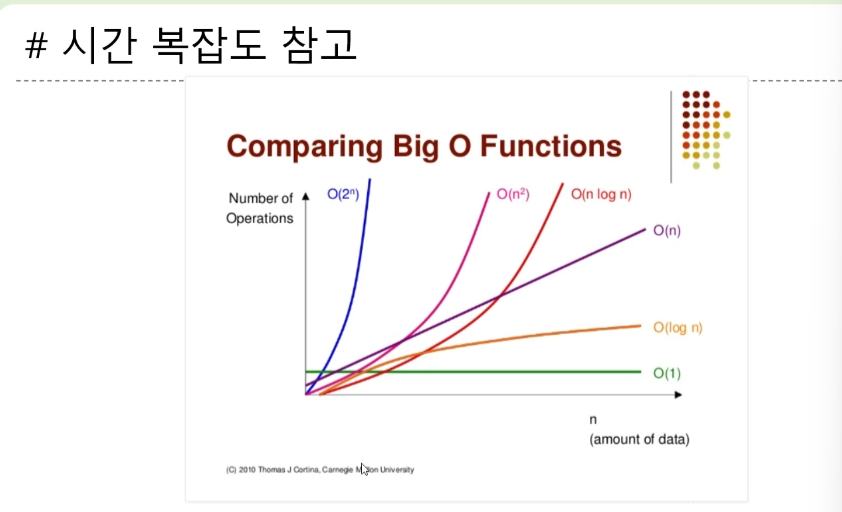
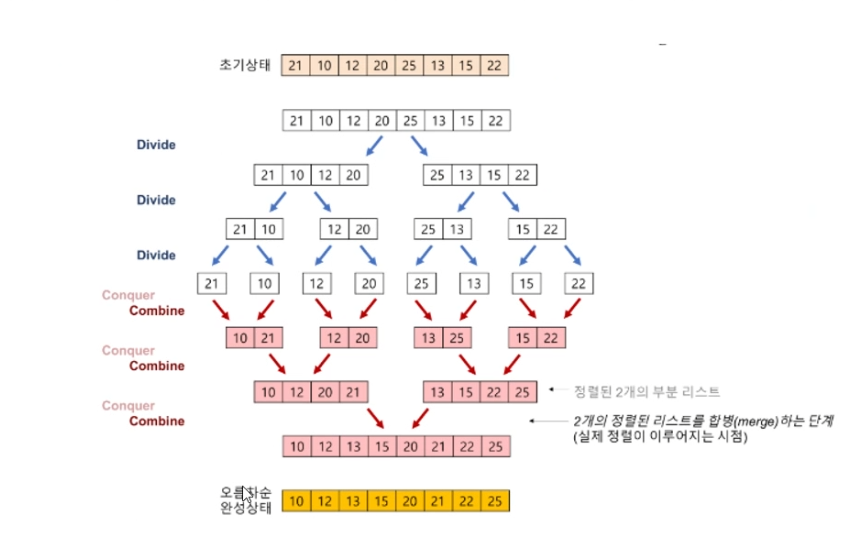
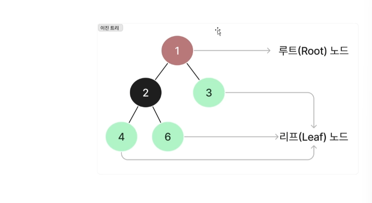
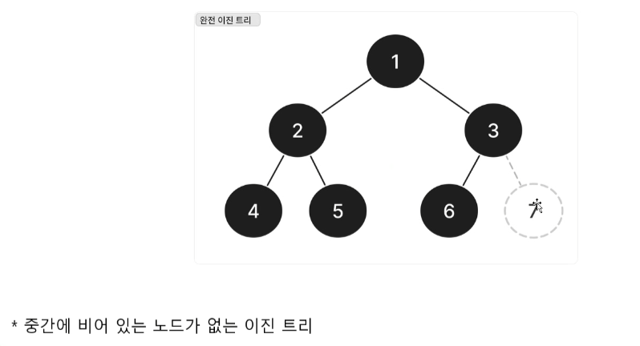
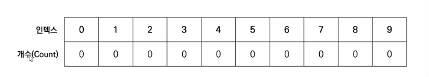
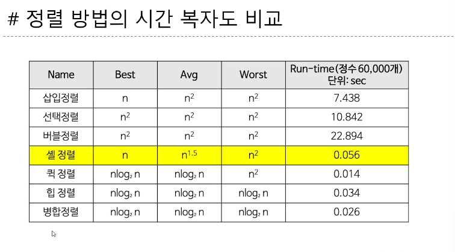

# 202530208 김은채 1106강의

## qsort 함수 
### qsort 함수
* bsearch 함수와 마찬가지로 int형이나 double형 등의 배열뿐만 아니라 구조체형 배열 등 모든 자료형의 배열에 적용 가능
* qsort 함수에 전달하는 4개 인수는 앞에서부터 차례대로 배열의 첫 번째 요소에 대한 포인터, 요소의 개수, 요소의 크기, 비교 함수에 대한 포인터
* 비교 함수는 아래의 값을 반환하며 직접 작성해야함 
    * 첫 번째 인수가 가리키는 값이 더 작은 경우 음수값(-1) 반환

    * 첫 번째 인수가 가리키는 값과 두 번쨰 인수가 가리키는 값이 같을 경우 0 반환
    * 첫 번째 인수가 가리키는 값이 더 큰 경우 양수값(1) 반환

## 정렬을 마친 배열 병합
### 병합(merge)
* **#a,b모두 정렬이 끝난 배열이 조건**
* 각 배열에서 선택한 요소를 비교-> 작은 값의 요소를 꺼내 새로운 배열에 넣는 작업을 반복 => 정렬을 마치는 배열을 만듦
* merge 함수는 요소의 개수가 na개인 배열 a와 요소의 개수가 nb개인 배열 b를 병합하여 배열c에 저장
* 이 함수에서는 세 개의 배열 a,b,c를 동시에 스캔
    * 이때 각 배열이 선택한 요소의 인덱스는 pa, pb, pc
    * 커서: 이 인덱스를 저장한 변수

* 처음에는 첫 요소를 선택하므로 커서를 모두 0으로 초기화

### 병합 정렬(merge sort)

* 정렬을 마친 배열의 병합을 응용하여 분할 정복법에 따라 정렬하는 알고리즘
* 먼저 배열을 앞부분과 뒷부분으로 나눔
* 나눈 두 배열을 각각 정렬, 병합하면 배열 모두를 정렬할 수 있음

### 병합 정렬 알고리즘
* 배열의 요소 개수가 2개 이상인 경우
    * 1. 배열의 앞부분을 병합 정렬로 정렬
    * 2. 배열의 뒷부분을 병합 정렬로 정렬
    * 3. 배열의 앞부분과 뒷부분을 병합

### 병합 정렬 참고

### 병합 정렬의 시간 복잡도
* 배열 병합의 시간 복잡도는 O(n)

## 힙 정의
### 힙
* '부모의 값이 자식의 값보다 항상 크다'는 조건을 만족하는 완전 이진트리
* a를 힙으로 만들면 b와 같은 상태가 됨
* 부모와 자식 관계는 항상 '부모의 값 >= 자식의 값
* 힙의 가장 위쪽에 있는 루트가 가장 큰 값
* 형제 사이에 대소 관계는 일정하지X

### 힙의 요소를 배열에 저장
* 가장 위쪽에 있는 루트10을 a[0]에 넣음
* 한 단계 아래 요소를 왼쪽에서 오른쪽으로 따라 감
* 인덱스의 값을 1씩 늘리면서 배열의 각 요소에 힘의 요소를 대입
* 이 과정을 거쳐 힙의 요소를 배열에 저장하면 부모와 자식의 인덱스 사이에 다음과 같은 관계가 성립
    * 1. 부모는 a[(i-1)/2]
    * 2. 왼쪽 자식은 a[(i*2+1)]
    * 3. 오른쪽 자식은 a[i*2+2]

## 힙 정렬
### 힙 정렬
* '가장 큰 값이 루트에 위치'하는 특징을 이용한 정렬 알고리즘
* 다음과 같은 작업을 반복해 그 과정에서 꺼낸 값을 늘어놓으면 정렬이 끝남
    * 힙에서 가장 큰 값인 루트를 꺼냄
    * 루트 이외의 부분을 힙으로 전환
* 힙 정렬은 선택 정렬을 응용한 알고리즘
* 힙에서 가장 큰 값인 루트를 꺼내고 **남은 요소에서 가시 가장 큰 값을 구해야 함**

### 루트를 없애고 힘 상태 유지하기
* 루트를 없앤 다음 다시 힙을 만들기 위해 요소를 알맞은 위치로 내려보내야 하는데 그 순서는 다음과 같음
    * 1. 루트를 꺼냄
    * 2. 마지막 요소를 루트로 이동
    * 3. 자기보다 큰 값을 가지는 **자식 요소와 자리를 바꾸며 아래쪽으로 내려가는 작업을 반복**하는데 이때 **자식의 값이 작거나 잎에 다다르면 작업이 종료**됨

## 힙이란? 
* 우선순위 큐를 위해 고안된 완전이진트리 형태의 자료구조
* 여러 값 중, 최대값과 최소값을 빠르게 찾아내도록 만들어진 자료구조
* 반정렬 상태를 유지
* ex. 부모 노드의 키 값이 자식 노드의 키 값보다 항상 큼 / 작음
* 이진탐색트리(BST)와 달리 중복된 값이 허용된다.

### 트리의 종류와 힙

## 도수 정렬
* 도수 정렬
    * 지금까지의 정렬 알고리즘은 두 요소의 키값을 비교해야 했음
    * 도수 정렬은 요소를 비교할 필요가 없다는 특징이 있음

* 도수 정렬 알고리즘
    * 도수분포표 만들기
    * 누적도수분포표 만들기
    * 목적 베열 만들기
    * 배열 복사하기

### 도수(개수) 정렬/counting sort
* 데이터의 대소 관계를 직접 비교하지 않고 각 요소의 '도수(개수)'를 세어 정렬하는 알고리즘
* 예시
    * [step0] 가장 작은 데이터부터 가장 큰 데이터까지의 범위가 모두 담길 수 있도록 리스트를 생성
    * 정렬할 데이터: 7 5 9 0 3 1 6 2 9 1 4 8 0 5 2 
    
    
