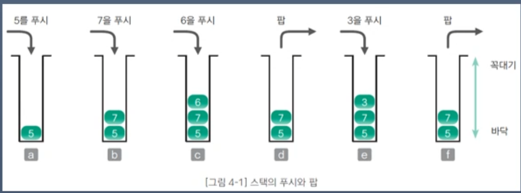
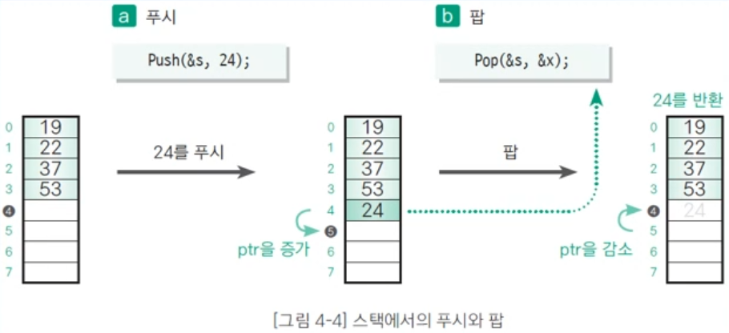

# 202530208 김은채 1127강의

## 스택(Stack)

### 후입선출(LIFO, Last In First Out): 가장 나중에 넣은 데이터를 가장 먼저 꺼냄.
* 푸시(push): 스택에 데이터를 넣는 작업
* 팝(pop): 스택에서 데이터를 꺼내는 작업
* 꼭대기(top): 푸시, 팝을 하는 위치
* 바닥(bottom): 스택의 가장 밑바닥 부분

### [ 기본 함수1 ]

* Initialize: 초기화 함수.
* Push(): 푸시 함수. 꼭대기(top) 데이터 넣기.
* Pop(): 팝 함수. 꼭대기(top) 데이터 꺼내기.
* Peek(): 피크 함수. top의 data 읽기.

