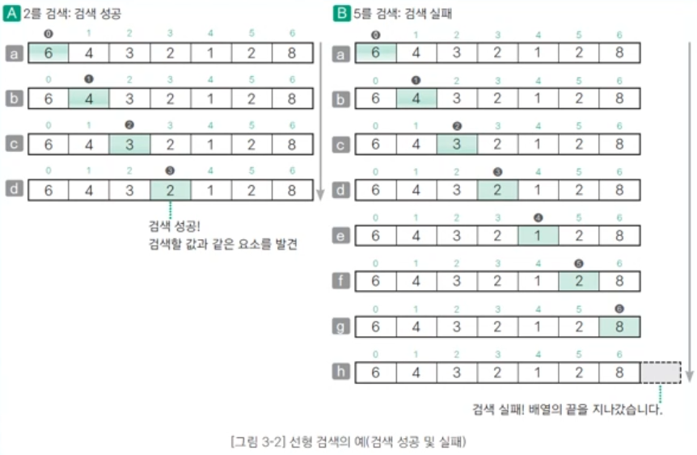

# 202530208 김은채 1127강의

## 스택(Stack)

### 후입선출(LIFO, Last In First Out): 가장 나중에 넣은 데이터를 가장 먼저 꺼냄.
* 푸시(push): 스택에 데이터를 넣는 작업
* 팝(pop): 스택에서 데이터를 꺼내는 작업
* 꼭대기(top): 푸시, 팝을 하는 위치
* 바닥(bottom): 스택의 가장 밑바닥 부분

### [ 기본 함수1 ]

* Initialize: 초기화 함수.
* Push(): 푸시 함수. 꼭대기(top) 데이터 넣기.
* Pop(): 팝 함수. 꼭대기(top) 데이터 꺼내기.
* Peek(): 피크 함수. top의 data 읽기.

### [ 기본 함수 2 ]

* Clear() : 스택의 모든 데이터를 삭제하는 함수.
* Capacity() : 용량을 확인하는 함수. 데이터를 넣을 수 있는 최대 공간.
* Size() : 데이터의 개수를 확인하는 함수.
* IsEmpty() : 스택이 비어 있는지 검사하는 함수. 비어 있으면 1, 그렇지 않으면 0을 반환.
* IsFull() : 스택이 가득 찼는지 검사하는 함수. 가득 찼으면 1, 그렇지 않으면 0을 반환.
* Search() : 임의의 값을 검색하는 함수.

* Print() : 모든 데이터를 출력하는 함수. 스택의 모든 데이터를 바닥부터 순서대로 출력.
* Terminate() : 종료 함수. Initialize 함수로 확보한 스택을 해제.

## 큐

* 선입선출(FIFO, Frist In Frist OUT): 먼저 넣은 데이터를 가장 먼저 꺼냄.
* 인큐(en-queue): 큐에 데이터를 넣는 작업.
* 디큐(de-queue): 데이터를 꺼내는 작업.
* 프런트(front): 데이터를 꺼내는 쪽.
* 리어(rear): 데이터를 넣는 쪽.

---
* 리어(rear)로부터 들어간 데이터를 프런트(front)부터 채워 나감.
* 24 인큐(en-queue): 리어(rear)에서 데이터 넣음. $O(1)$
* 19 디큐(de-queue): 프런트(front)부터 데이터를 꺼냄.
    * $\rightarrow$ 나머지 데이터 프런트(front)로 하나씩 이동. $O(n)$
* 데이터 입출입이 빈번한 경우 원형 큐로 구현하는 것이 효율적.
---
### [ 기본 함수 ]

* Initialize() : 초기화 함수.

* Enque() : 인큐 함수. 프런트(front)에서 데이터 넣기.

* Deque() : 디큐 함수. 리어(rear)에서 데이터 꺼내기.

* Peek() : 피크 함수. 프런트(front)에서 데이터 읽기.

* Clear() : 큐의 모든 데이터를 삭제하는 함수.

* Capacity() : 용량을 확인하는 함수. 데이터를 넣을 수 있는 최대 공간.

* Size() : 데이터의 개수를 확인하는 함수.

* IsEmpty() : 큐가 비어 있는지 검사하는 함수. 비어 있으면 1, 그렇지 않으면 0을 반환.

* IsFull() : 큐가 가득 찼는지 검사하는 함수. 가득 찼으면 1, 그렇지 않으면 0을 반환.

* Search() : 임의의 값을 검색하는 함수.

## 1. 선형 검색(linear search)

* 선형 검색(linear search) 또는 순차 검색(sequential search)이라고 함.
* 원하는 키 값을 갖는 데이터를 만날 때까지 맨 앞부터 순서대로 데이터를 검색.
* 시간 복잡도는 O(n)

 
---

## 2. 이진 검색(binary search)

* 오름차순 또는 내림차순으로 **정렬된 데이터**에서 검색.
* 배열의 '**중간 값**'을 선택하고 찾고자 하는 값과 비교.
* 만약 중간 값이 찾고자 하는 값보다 크다면 '**배열 왼쪽 부분**'에서 탐색을 진행하고, 작으면 '**배열 오른쪽 부분**'에서 탐색을 진행
* 이 과정에서 찾고자 하는 값이 나올 때까지 **반복**.

## 정렬
### 1. 정렬(sorting)이란 무엇인가?

* 이름, 학번, 키 등 핵심 항목(**key**)의 대소 관계에 따라 **데이터 집합**을 일정한 순서로 줄지어 늘어서도록 바꾸는 작업.

* **오름차순(ascending order) 정렬** : **키 값이 작은 데이터부터 큰 순서로** 정렬.

* **내림차순(descending order) 정렬** : **키 값이 큰 데이터부터 작은 순서로** 정렬.

### 2. 버블 정렬(bubble sort)

* **인접한 두 데이터**를 비교하여 기준에 만족하면 데이터를 서로 **교환**해서 완성될 때까지 반복하는 정렬 방법. * **오름차순 정렬**의 두 데이터 비교하여 **앞쪽 값**이 더 **크면** 데이터를 교환.
* **내림차순 정렬**의 두 데이터 비교하여 **앞쪽 값**이 더 **작으면** 데이터를 교환.
* **시간 복잡도**는 $O(n^2)$.

### 3. 퀵 정렬(quick sort)

* 리스트 가운데서 **하나의 원소**를 고른다. 이렇게 고른 원소를 **피벗(pivot)**이라고 합니다.
* 피벗 앞에 피벗보다 값이 작은 모든 원소들이 오고, 피벗 뒤에는 피벗보다 값이 큰 모든 원소들이 오도록 피벗을 기준으로 리스트를 둘로 나눕니다.
* 이렇게 하면 배열이 두 부분으로 나뉘어 집니다.
* 이 두 개의 배열에서 각각 **새로운 피벗**을 만들어서 두 개의 배열로 다시 나누어 줍니다.
* 더 이상 배열을 쪼갤 수 없을 때까지 계속 진행합니다.
* **재귀(Recursion)**적으로 이 과정을 반복한다는 의미입니다.
* 이 과정은 **분할 정복**의 원리를 이용한 것입니다.

* 피벗을 중심으로 **문제를 분할**하고, 피벗을 기준으로 해서 작은 값과 큰 값을 나열하는 **정복 과정**을 거친 뒤, 모든 결과를 합칠 해서 큰 전체 문제를 **해결**한다.
* **시간 복잡도**는 $O(n \log n)$.

### 4. 힙 정렬(Heap sort)

* **최댓값, 최솟값**을 쉽게 추출할 수 있는 **자료 구조**입니다.
* **최대 힙 트리**(내림차순 정렬)나 **최소 힙 트리**(오름차순 정렬)를 구성해 정렬을 하는 방법 * **$n$개**의 노드로 이루어진 **완전 이진 트리**를 구성합니다.
* 이때 루트 노드부터 **부모 노드, 왼쪽 자식 노드, 오른쪽 자식 노드** 순서로 구성합니다.
* 정렬해야 할 $n$개의 요소들로 **최대 힙**(내림차순 기준)을 만듭니다.
* 다음으로 한 번에 하나씩 요소를 힙에서 **꺼내서** 배열의 **뒷부분부터 저장**하면 된다.
* 삭제되는 요소들(최댓값부터 삭제)은 값이 **감소되는 순서로 정렬**되게 된다.

### 5. 도수 정렬(counting sort)

* **원소의 대소 관계를 판단하지 않고** 빠르게 정렬하는 알고리즘으로, **분포 수 세기(distribution counting)** 정렬이라고도 합니다.
* 배열 내 요소 값들의 개수를 저장하는 **카운트 배열(도수 분포표) $f$**를 생성하고 배열의 모든 원소 값을 $0$으로 초기화합니다. 

### 도수 정렬(counting sort) 계속

* [Step 15] 결과적으로 최종 리스트에는 각 데이터가 몇 번씩 등장했는지 그 횟수가 기록됩니다.
* 정렬할 데이터: **759031629148052**

| 인덱스 | 0 | 1 | 2 | 3 | 4 | 5 | 6 | 7 | 8 | 9 |
| :--- | :--: | :--: | :--: | :--: | :--: | :--: | :--: | :--: | :--: | :--: |
| 개수(Count) | 2 | 2 | 2 | 1 | 1 | 2 | 1 | 1 | 1 | 2 |

* 결과를 확인할 때는 리스트의 첫 번째 데이터부터 하나씩 그 값만큼 반복하여 인덱스를 출력합니다.

| 인덱스 | 0 | 1 | 2 | 3 | 4 | 5 | 6 | 7 | 8 | 9 |
| :--- | :--: | :--: | :--: | :--: | :--: | :--: | :--: | :--: | :--: | :--: |
| 개수(Count) | 2 | 2 | 2 | 1 | 1 | 2 | 1 | 1 | 1 | 2 |

* 출력 결과: **0 0 1 1 2 2 3 4 5 5 6 7 8 9 9**

## 리스트 
### 1. 선형 리스트(Linear List)

* 데이터를 **일렬로 나열**하고 **순서대로 저장**하는 가장 간단한 형태의 **자료 구조**입니다. * **논리적 순서**와 **물리적 순서**가 일치하며, 메모리에 **연속적**으로 저장되는 특징이 있습니다.
* **배열**이 대표적인 선형 리스트의 예입니다.

* 장점
    * 인덱스(Index)로 접근할 수 있기 때문에 **접근 속도**가 매우 빠릅니다.
    * **연속된 메모리 공간**에 존재하기 때문에 관리하기가 편리합니다.

* 단점
    * 배열을 이용해 구현하기 때문에 배열이 갖고 있는 **메모리 사용의 비효율성** 문제를 그대로 가지고 있습니다.
    * **삽입 & 삭제 연산** 후에 연속적인 물리 주소를 유지하기 위해 **원소들을 이동**시키는 추가 작업과 시간이 소요됩니다.

### 2. 연결 리스트(linked list)

* 각 노드가 **데이터와 포인터**를 가지고 한 줄로 연결되어 있는 방식으로 데이터를 저장하는 자료 구조입니다. * 데이터 **노드(node)**를 저장할 때 **하나의 데이터**와 그 다음 데이터로 가는 **주소(다음 노드의 주소)**를 함께 저장하여, **논리적**으로 **연결(link)**하는 방식으로 자료를 저장합니다.
* 데이터는 논리적으로 연결되어 있으므로 배열과 달리 **데이터의 삽입 삭제가 자유롭고**, 자연스럽게 **전체 크기를 늘리고 줄이는** 것 또한 가능합니다.

#### 연결 리스트의 종류

* **단순 연결 리스트(singly linked list)** : 데이터와 함께 **다음 노드의 주소(포인터)**를 함께 가지고 있는 구조입니다. 
* **이중 연결 리스트(doubly linked list)** : 데이터와 함께 **이전**과 **다음 노드의 주소**를 모두 함께 가지고 있는 구조입니다. 
* **순환 연결 리스트(circular linked list)** : 단순 연결 리스트의 마지막 노드가 **첫 번째 노드의 주소**를 가지고 있는 구조입니다. 

* **원형 이중 연결 리스트(circular doubly linked list)** : 이중 연결 리스트와 순환 연결 리스트를 합친 구조입니다. 

## 트리

### 1. 트리란?
* 트리를 구성하는 요소는 **노드(node)**와 **가지(edge)** 두 가지입니다. * 각각의 노드는 가지를 통해 다른 노드와 연결되어 있습니다.
* **루트(root) 노드** : 트리의 가장 윗부분에 위치하는 노드로 트리에 **단 한 개**만 존재합니다.
* **단말(leaf) 노드** : 트리의 아랫부분에 위치하여 **자식 노드가 없는** 노드입니다.
* **내부(internal) 노드** : 단말 노드가 아닌 노드로 여기에는 **루트 노드도 포함**됩니다.

* **트리의 크기(size)**: **루트 포함**한 **모든** 노드의 개수
* **트리의 깊이(depth)**: 루트에서 어떤 노드에 도달하기 위해 거쳐야 하는 **간선의 수**
* **트리의 레벨(level)**: 트리의 **특정 깊이**를 가지는 노드의 집합
* **트리의 차수(degree)**: 각 노드가 지닌 **가지의 수**
* **트리의 차수(degree of tree)**: 트리의 **최대 차수**
* **트리의 높이(height)**: 루트 노드에서 **가장 깊숙이 있는 노드의 깊이**
* **서브 트리(subtree)**: 트리 안에서 다시 어떤 노드를 **루트**로 정하고 그 자손으로 이루어진 트리 * **널 트리(null tree)**: **노드, 가지가 없는** 트리

### 3. 완전 이진 트리(complete binary tree)

* **루트**부터 노드가 채워져 있으면서 같은 레벨에서는 **왼쪽에서 오른쪽**으로 노드가 채워져 있는 **이진 트리**
    1. **마지막 레벨**을 제외한 레벨은 노드를 **가득 채움**
    2. 마지막 레벨은 **왼쪽부터 오른쪽** 방향으로 노드를 채우되 반드시 끝까지 채울 필요는 없음 * 높이가 $k$인 완전 이진 트리가 가질 수 있는 노드의 **최댓값**은 $2^{k+1} - 1$ 개 (교재)
* 따라서 $n$개의 노드를 저장할 수 있는 완전 이진 트리의 **높이**는 $\log n$ (교재)
* 완전 이진 트리에서 **너비 우선 탐색**을 하며, 각 노드에 $0, 1, 2, \dots$ 값을 주면 **배열에 저장하는 인덱스**와 **일대일로 대응**

### 4. 이진 검색 트리(binary Search tree)

* 이진 검색 트리의 특징은 다음과 같습니다. 
    1. 구조가 단순함
    2. **중위 순회**를 하면 **키 값의 오름차순**으로 노드를 얻을 수 있음
    3. 이진 검색과 비슷한 방식으로 **빠르게 검색**할 수 있음
    4. 노드를 삽입하기 쉬움

### 검색 과정
    1. **루트**에서 시작합니다.
    2. **검색 값**을 루트와 비교합니다. 루트보다 작으면 **왼쪽**에 대해 재귀하고 크다면 **오른쪽**으로 재귀합니다.
    3. 일치하는 값을 찾을 때까지 절차를 **반복**합니다.
    4. 검색 값이 없으면 **null**을 반환합니다.

### 삽입 과정
    1. **Root**에서 시작합니다.
    2. **삽입 값**을 루트와 비교합니다. 루트보다 작으면 **왼쪽**으로 재귀하고 크다면 **오른쪽**으로 재귀합니다.
    3. **리프 노드**에 도달한 후 노드보다 크다면 **오른쪽**에 작다면 **왼쪽**에 삽입합니다.

### 삭제 과정
    1. 삭제할 노드가 리프 노드인 경우는 검색 후 바로 삭제하면 됩니다. 그림은 $1$을 삭제하는 경우입니다. 
    2. 삭제할 노드에 **자식**이 **하나**만 있는 경우는 노드를 삭제하고 자식 노드를 삭제된 노드의 부모에 직접 연결합니다.
    3. 삭제할 노드에 **자식이 둘** 있는 경우는 **successor 노드**를 찾는 과정이 추가됩니다.     * **successor 노드**란 삭제할 노드의 값보다 크면서 **가장 작은 키**를 가진 노드입니다.
        * 즉 **오른쪽 서브 트리 중에서 가장 작은 값**을 의미합니다.

## 해시법

### 1. 해시 법이란(Hashing)?

* **해시법**은 데이터를 저장할 **인덱스**를 **해시 함수**로 계산하여, 데이터의 **검색, 추가, 삭제**를 효율적으로 수행하는 **자료 구조**입니다. * **해시 함수**를 이용해 **키(key) 값**을 **고정된 길이의 해시 값**으로 변환하고, 이 해시 값을 **배열의 인덱스**로 사용하여 데이터를 저장하는 방식입니다.
* 이 과정에서 여러 키가 동일한 해시 값으로 변환되는 **해시 충돌**이 발생할 수 있으며, 이를 해결하기 위해 **체인 법**이나 **개방 주소 법** 같은 방법들이 사용됩니다.

[ 해시법의 핵심 요소 ]

* **해시 함수**: **임의의 길이**를 가진 데이터를 **고정된 길이의 값**으로 변환하는 함수입니다.
* **해시 테이블**: 해시 함수를 얻은 **해시 값**을 **인덱스**로 사용하여 데이터를 저장하는 **배열 기반의 자료 구조**입니다.
* **해시 충돌**: 서로 다른 키 값이 해시 함수를 통해 **같은 해시 값**으로 변환되어 **같은 인덱스에 저장**하는 현상입니다.

### 2. 해시 값을 사용하는데 왜 충돌이 발생하나?

* **Git** 등에서 쓰는 해시는 사실상 충돌이 없다고 간주할 만큼 **강력한 암호학적 해시**입니다.
* 이에 반해 **자료구조 해시**는 **빠른 접근**을 위해 설계된 **약한 해시**입니다.
* 따라서 Git 같은 시스템에서는 사실상 충돌이 거의 발생하지 않지만, **자료구조**에서는 충돌이 **자주 발생**합니다.

1. Git의 해시(SHA-1/SHA-256)는 **암호학적 해시(Cryptographic Hash)**입니다.
    * 입력이 조금만 달라도 **완전히 다른 해시**가 나옴. (**Avalanche effect**)
    * **임의로 충돌**을 만들기는 불가능.
    * **충돌 확률** = $2^{160}$ 분의 $1$ (SHA-1 기준) $\rightarrow$ 약 $10^{48}$분의 $1$ ($10^{-48}$) $\rightarrow$ 사실상 우주에서 원자 $1$개 찾기보다 어려움.
    * 즉, Git에서의 해시 충돌은 이론적으로는 가능하지만 **현실적으로 불가능한 사건**으로 취급하기 때문에 별도의 충돌 처리 법을 쓰지 않습니다. 

2. 자료구조의 해시는 "빠르고 단순하기 위해 만든 해시 함수
    * **자료구조 (해시 테이블)**에서 사용하는 해시는 목적이 전혀 다름.

    * **요구 조건**
        * 계산이 매우 빨라야 함 ($O(1)$)
        * 숫자나 문자열을 적당히 **분산**시키기만 하면 충분
        * 충돌이 나도 **체인법/개방 주소법**으로 해결하면 됨

    * **해시 함수 예**: $h(k) = k \pmod{table\_size}$ 또는 문자열이면 **char code** 단순 더하기, 곱하기 정도입니다.

    * 즉, 자료구조의 해시 함수는 **수학적으로 충돌을 피할 능력이 거의 없습니다.**
    * 처음부터 **충돌이 발생할 것**을 전제로 설계된 것이라고 할 수 있습니다. 

 3. 체인 법(Chaining, Separate Chaining)

    * 해시 테이블의 각 버킷이 **리스트(연결 리스트 등)**를 가지고 있어서, 충돌이 발생하면 그 버킷의 리스트에 **노드를 추가**하는 방식입니다. 
    * **예시 (해시 함수: key % 5)**
    > Key: $7 \rightarrow 7 \pmod 5 = 2 \rightarrow \text{bucket}[2] = [7]$
    > Key: $12 \rightarrow 12 \pmod 5 = 2 \rightarrow \text{bucket}[2] = [7, 12]$
    > Key: $17 \rightarrow 17 \pmod 5 = 2 \rightarrow \text{bucket}[2] = [7, 12, 17]$

* **장점**
    * 구현이 매우 **간단**
    * 테이블이 거의 가득 차도 **삽입 가능** (list만 늘리면 됨)
    * 삭제가 **쉬움** (리스트에서 node만 제거)

* **단점**
    * 충돌이 많아지면 리스트 길이가 길어져 **검색 시간이 $O(n)$으로 악화**
    * 리스트를 위한 **추가 메모리 사용**
    * **포인터 사용**으로 메모리 **locality**가 떨어져 느려질 수 있음
